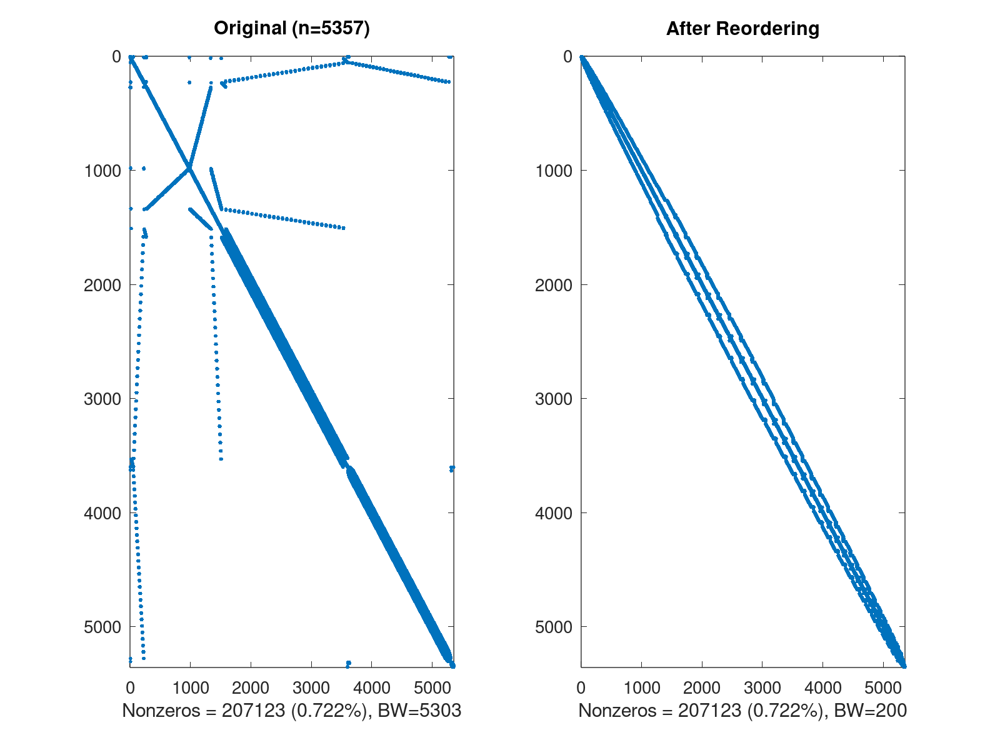

# Project Description

Sparse matrix reordering consists of swapping the matrix rows and columns in order to reduce the fill-in or/and the matrix bandwidth. The main benifits of reordering are calculation speed-up and memory storage reducing. Many algorithms can be used to reorder sparse matrices. In this project, I implemented few .m functions which allow to reorder a sparse matrix read from a [Matrix Market](https://math.nist.gov/MatrixMarket/) file using the [Reverse Cuthill-McKee algorithm](https://en.wikipedia.org/wiki/Cuthill%E2%80%93McKee_algorithm). In addition to reordering, it is possible to write the reordered sparse matrix to a Matrix Market file, plot it side-by-side with the original, compute few statistics about it and output the plot as a PNG file. All these functions can be applied to a single input matrix or multiple matrices stored in a given folder. 

## Features

The implemented functions allow to:
* Read and write a sparse matrix in Matrix Market file format
* Reorder a sparse matrix using the Reverse Cuthill-McKee algorithm
* Plot the original and reorderd matrices side-by-side
* Output statistics about both matrices (e.g., size, number of non-zeros, fill-in factor, bandwidth)
* Save the plot automatically as a PNG
* Manipulate either single or multiple matrices (batch reordering)

## Getting Started

The implemented functions can be used to reorder either a single matrix at once or multiple matrices sequentially.

### Single Matrix Reordering

To reorder a single matrix, the function `ReorderAndView` is used as follows:

```Matlab
%% Initialize input and output matrix market filenames
i_mtx_filename = './data/nist/s3rmt3m3.mtx';
o_mtx_filename = './data/nist/output/s3rmt3m3_rcm.mtx';

%% Invoke the single-file reorder and view function
%% If the flag save_as_png=1, the plot will be saved to disk as './output_{nz}.png' 
ret = ReorderAndView(i_mtx_filename, o_mtx_filename, save_as_png=1);
```

### Multiple Matrices Reordering

The batch reordering mode can be useful if one needs to reorder several matrices at once (large matrices can take significant time to be processed). For this purpose, the function `ReorderMMFromFolder` can be used to sequentially reorder all the matrices stored under a given folder. The reordered matrices are automatically stored under the folder `Output`, a child of the given folder. 

```Matlab
%% Specify the file of Matrix Market files
folder = './data/nist';

%% Invoke batch reordering function
ReorderMMFromFolder(folder);
```

The plots of each matrix are automatically generated and saved in the current script path.

## Examples

The folder [data](data/NIST) contains eighteen (18) symmetric matrices downloaded from the NIST official Matrix Market [website](https://math.nist.gov/MatrixMarket/). To test the behavior of the provided functions, one can proceed as follows:

### Single Matrix Reordering

Invoke the script in the file `reorder_single_file.m`. The output is similar to this:

```
Processing file ./data/nist/s3rmt3m3.mtx . . . . . . DONE
File conversion took 8.372852 seconds.
Plot saved as image in the file output_207123.png.
```
The saved plot is pictured below:



### Multiple Matrices Reordering

Invoke the script in the file `batch_reordering.m`. A snippet of the output is similar to this:

```
Processing file: ./data/nist/bcsstk17.mtx . . . . . . DONE
File conversion took 16.397006 seconds.

Processing file: ./data/nist/bcsstk18.mtx . . . . . . DONE
File conversion took 5.958057 seconds.

Processing file: ./data/nist/bcsstk25.mtx . . . . . . DONE
File conversion took 9.842160 seconds.
```

## Compatibility With Matlab

This first release of the project is developed under [GNU Octave 5.1.0](https://www.gnu.org/software/octave/) and is not fully compatible with any recent release of Mathworks Matlab.

## Dependencies

This project uses [Matrix Market I/O Function for Matlab](https://math.nist.gov/MatrixMarket/mmio/matlab/mmiomatlab.html) released by NIST, to read and write matrix market files.

## Built With

* [GNU Octave](https://www.gnu.org/software/octave/) - (version 5.1.0)

## License

This project is licensed under the MIT License - see the [LICENSE](LICENSE) file for details.

